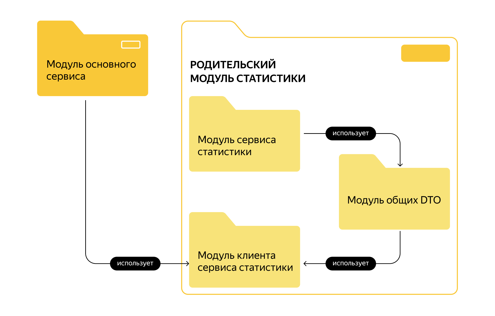

# Этап 1. Сервис статистики

Первый этап — реализация сервиса статистики. Его функционал достаточно прост и ограничен, поэтому начать с него будет
лучше всего. Реализация сервиса статистики позволит вам разобраться со спецификацией API и основными требованиями ТЗ, а
также подготовить сборку проекта.
На первом этапе необходимо:

- Реализовать сервис статистики в соответствии со спецификацией: [de-stats-service.yml](de-stats-service-spec.json).
- Реализовать HTTP-клиент для работы с сервисом статистики.
- Подготовить сборку проекта.

Что будет проверяться

- Работающая сборка проекта:
    - проект компилируется без ошибок;
    - сервис статистики успешно запускается в докер-контейнере;
    - экземпляр PostgreSQL для сервиса статистики успешно запускается в докер-контейнере.
- Корректная работа сервиса статистики:
    - все эндпоинты отрабатывают в соответствии со спецификацией;
    - данные успешно сохраняются и выгружаются из базы данных;
    - реализован HTTP-клиент сервиса статистики.

## Как подготовить сборку проекта

1. Учитывайте многомодульность.

Приложение дипломного проекта должно состоять из двух отдельно запускаемых сервисов — в контексте сборки проекта при
помощи Maven это означает, что проект будет многомодульным. Но это ещё не всё. Сами сервисы можно также разбить на
подмодули.

Сервис статистики должен состоять из HTTP-сервиса и HTTP-клиента. Это значит, что модуль статистики можно разделить на
два подмодуля.

Механизм взаимодействия сервиса и клиента предполагает, что они будут использовать одни и те же объекты для запросов и
ответов. Исходя из этого, можно выделить еще один подмодуль, в котором будут размещены общие классы DTO.

Структуру модулей и зависимостей можно представить в виде такой схемы.

2. Поработайте с файлами.

- модули основного сервиса и сервиса статистики должны содержать `Dockerfile`;
- в корне проекта должен быть создан файл `docker-compose.yml`, описывающий запуск контейнеров с сервисами проекта и
  базами данных для них.
- файл `pom.xml`, описывающий сборку основного сервиса, на данном этапе должен содержать только указание на родительский
  модуль и идентификатор артефакта.

[Postman-тесты](de-stats-svc-postman.json)
